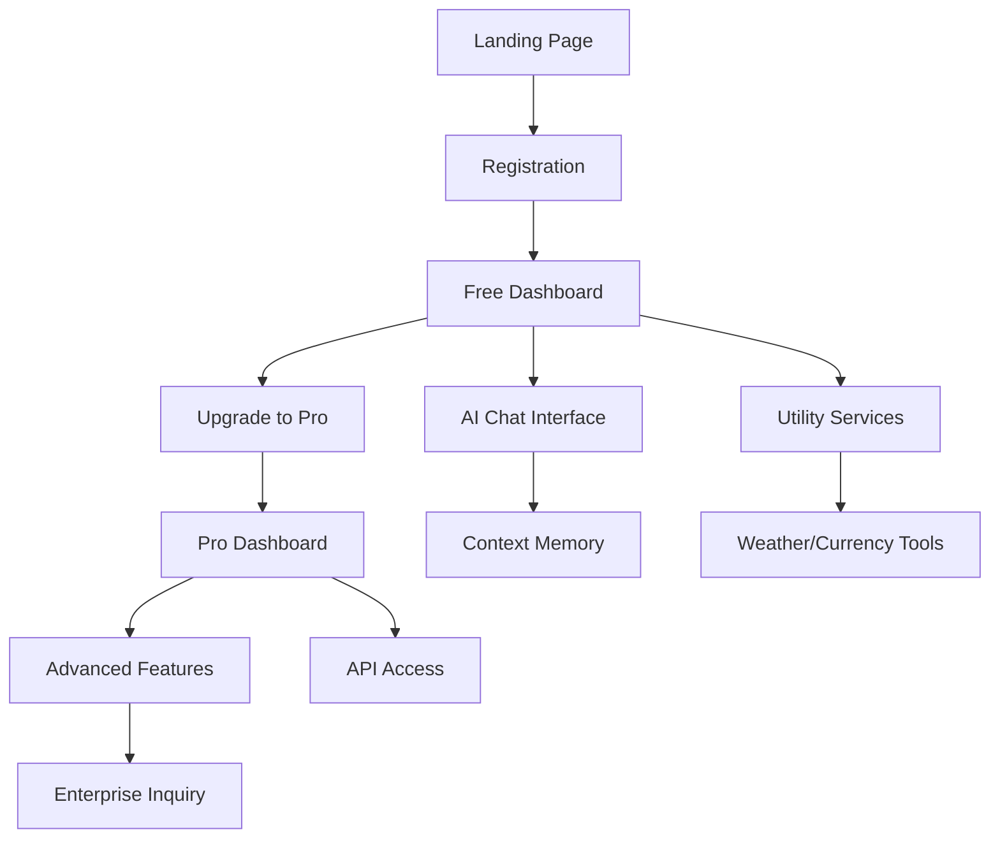

# AI Multi-Service Platform - Product Requirements Document

## 1. Product Overview

AI Multi-Service Platform is a comprehensive AI-powered service that provides unlimited free tier access to multiple AI models, context memory, and utility services. The platform targets students, developers, and small businesses who need reliable AI assistance without budget constraints, solving the problem of expensive AI API costs and limited free tiers from existing providers.

The product aims to generate ₹5,00,000+ monthly revenue within 6 months while serving 10,000+ users through a freemium model with premium subscriptions starting at ₹99/month.

## 2. Core Features

### 2.1 User Roles

| Role | Registration Method | Core Permissions |
|------|---------------------|------------------|
| Free User | Email registration | Basic AI chat, limited context memory, basic utilities |
| Pro User | Subscription upgrade (₹99/month) | Unlimited AI access, full context memory, premium features |
| Enterprise User | Custom pricing | API access, team management, priority support |

### 2.2 Feature Module

Our AI Multi-Service Platform consists of the following main pages:

1. **Home Page**: Hero section showcasing unlimited free tier, feature highlights, pricing comparison, user testimonials.
2. **Chat Interface**: AI conversation interface, context memory indicators, model selection, conversation history.
3. **Dashboard**: Usage analytics, subscription management, API key management, billing information.
4. **Utility Services**: Weather information, currency conversion, image processing tools, code assistance.
5. **Mobile App**: Cross-platform mobile interface, offline context sync, push notifications.
6. **Admin Panel**: User management, analytics dashboard, system monitoring, revenue tracking.

### 2.3 Page Details

| Page Name | Module Name | Feature description |
|-----------|-------------|---------------------|
| Home Page | Hero Section | Display value proposition with unlimited free tier messaging, feature comparison table |
| Home Page | Pricing Section | Show freemium model with clear upgrade paths, student discounts |
| Home Page | Testimonials | User success stories and platform benefits |
| Chat Interface | AI Chat Engine | Multi-model AI integration (OpenAI, Google AI, Claude) with automatic fallback |
| Chat Interface | Context Memory | Session-based context preservation, conversation threading, context export |
| Chat Interface | Model Selection | Allow users to choose between different AI models, show model capabilities |
| Dashboard | Usage Analytics | Track API calls, context usage, feature utilization with visual charts |
| Dashboard | Subscription Management | Upgrade/downgrade plans, billing history, payment methods |
| Dashboard | API Integration | Generate API keys, documentation, usage limits |
| Utility Services | Weather Service | Real-time weather data, location-based forecasts, weather alerts |
| Utility Services | Currency Converter | Real-time exchange rates, historical data, conversion calculator |
| Utility Services | Image Processing | Background removal, image enhancement, format conversion |
| Utility Services | Code Assistant | Code generation, debugging help, documentation generation |
| Mobile App | Cross-platform Interface | React Native app with full feature parity, offline capabilities |
| Mobile App | Sync Management | Real-time synchronization between web and mobile platforms |
| Admin Panel | User Management | User analytics, subscription tracking, support ticket management |
| Admin Panel | System Monitoring | API health monitoring, usage analytics, performance metrics |

## 3. Core Process

**Free User Flow:**
Users register with email → Access basic AI chat with limited context → Use utility services with daily limits → Upgrade prompts for premium features → Convert to paid subscription

**Pro User Flow:**
Existing users upgrade subscription → Access unlimited AI models → Full context memory → Premium utility features → API access → Potential enterprise upgrade

**Admin Flow:**
Admins monitor system health → Analyze user metrics → Manage subscriptions → Handle support tickets → Optimize resource allocation

## 4. User Interface Design

### 4.1 Design Style

- **Primary Colors**: Deep blue (#1e40af) for trust and technology, bright green (#10b981) for success and growth
- **Secondary Colors**: Light gray (#f8fafc) for backgrounds, dark gray (#374151) for text
- **Button Style**: Rounded corners (8px radius) with subtle shadows, gradient backgrounds for CTAs
- **Typography**: Inter font family, 16px base size, clear hierarchy with 24px/32px/48px headings
- **Layout Style**: Card-based design with clean spacing, top navigation with sidebar for dashboard
- **Icons**: Heroicons style with consistent 24px sizing, tech-focused iconography

### 4.2 Page Design Overview

| Page Name | Module Name | UI Elements |
|-----------|-------------|-------------|
| Home Page | Hero Section | Large heading with gradient text, animated background, prominent CTA button |
| Home Page | Features Grid | 3-column card layout, icons with descriptions, hover animations |
| Chat Interface | Message Area | WhatsApp-style chat bubbles, typing indicators, model badges |
| Chat Interface | Input Section | Expandable text area, send button, attachment options, model selector |
| Dashboard | Analytics Cards | Colorful metric cards with charts, progress bars, trend indicators |
| Dashboard | Navigation | Sidebar with icons, breadcrumb navigation, user profile dropdown |
| Utility Services | Tool Cards | Grid layout with tool previews, quick access buttons, usage indicators |
| Mobile App | Bottom Navigation | 5-tab navigation, floating action button for new chat |

### 4.3 Responsiveness

The platform is mobile-first responsive design with breakpoints at 640px, 768px, and 1024px. Touch interactions are optimized for mobile with larger tap targets (44px minimum) and swipe gestures for navigation. Desktop version includes keyboard shortcuts and hover states for enhanced productivity.

## 5. Technical Requirements

### 5.1 Performance Requirements
- Page load time: < 2 seconds on 3G connection
- API response time: < 500ms for chat responses
- Uptime: 99.9% availability target
- Concurrent users: Support 1000+ simultaneous users

### 5.2 Security Requirements
- JWT-based authentication with refresh tokens
- API rate limiting per user tier
- Data encryption in transit and at rest
- GDPR compliance for user data

### 5.3 Integration Requirements
- Multiple AI API integrations with fallback logic
- Payment gateway integration (Razorpay)
- Email service integration for notifications
- Analytics integration (Google Analytics)

## 6. Success Metrics

### 6.1 User Metrics
- Monthly Active Users (MAU): Target 10,000+ by month 6
- User Retention: 40% monthly retention rate
- Conversion Rate: 5% free to paid conversion
- Daily Active Users: 30% of MAU

### 6.2 Business Metrics
- Monthly Recurring Revenue: ₹5,00,000+ by month 6
- Customer Acquisition Cost: < ₹500 per user
- Lifetime Value: > ₹2,000 per paid user
- Churn Rate: < 5% monthly for paid users

### 6.3 Technical Metrics
- API Success Rate: > 99.5%
- Average Response Time: < 500ms
- Error Rate: < 0.1%
- System Uptime: > 99.9%

## 7. Launch Strategy

### 7.1 Phase 1: MVP Launch (Weeks 1-8)
- Basic AI chat with 2-3 model integrations
- Simple subscription system
- Core utility services
- Target: ₹25,000 monthly revenue

### 7.2 Phase 2: Feature Expansion (Weeks 9-16)
- Mobile app launch
- Advanced AI features
- Enhanced utility services
- Target: ₹1,00,000 monthly revenue

### 7.3 Phase 3: Scale & Enterprise (Weeks 17-24)
- Enterprise features
- API marketplace
- Advanced analytics
- Target: ₹5,00,000+ monthly revenue

## 8. Risk Mitigation

### 8.1 Technical Risks
- **API Dependency**: Multiple fallback providers, rate limiting
- **Scaling Issues**: Cloud-native architecture, auto-scaling
- **Security Vulnerabilities**: Regular security audits, penetration testing

### 8.2 Business Risks
- **Competition**: Focus on unique value proposition (unlimited free tier)
- **User Acquisition**: Leverage student networks, referral programs
- **Revenue Goals**: Conservative projections, multiple monetization streams

### 8.3 Team Risks
- **Academic Conflicts**: Flexible scheduling, documentation
- **Skill Gaps**: Mentorship programs, learning resources
- **Retention**: Equity participation, learning opportunities

This PRD serves as the foundation for building a successful AI Multi-Service Platform that leverages student resources and zero-budget constraints to create a profitable, scalable business.