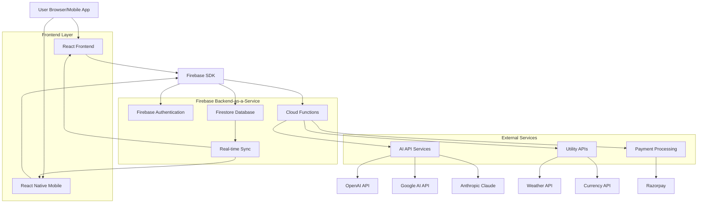

# 🔥 Updated Backend Architecture with Firestore

## 📋 Executive Summary

This document provides an updated technical architecture recommendation for the AI Multi-Service Platform, with **Google Firestore** as the primary database solution. Firestore is recommended for its ease of use, student-friendly pricing, real-time capabilities, and production scalability - making it ideal for a zero-budget student startup.

**Key Recommendation**: Replace PostgreSQL with Firestore for faster development, lower complexity, and better scalability.

---

## 🎯 Why Firestore for Student Startups?

### ✅ **Student-Friendly Advantages**

#### **1. Zero Learning Curve**
- **No SQL Required**: Simple document-based queries
- **Intuitive Structure**: JSON-like documents, easy to understand
- **Visual Interface**: Firebase Console for easy data management
- **Excellent Documentation**: Comprehensive guides and tutorials

#### **2. Cost-Effective for Students**
- **Generous Free Tier**: 50,000 reads, 20,000 writes, 1GB storage daily
- **Pay-as-you-scale**: No upfront costs or server management
- **Student Credits**: Additional credits through Google Cloud Education
- **Predictable Pricing**: Clear pricing model, no surprise bills

#### **3. Rapid Development**
- **Real-time Updates**: Built-in real-time synchronization
- **Offline Support**: Automatic offline capabilities
- **Authentication Integration**: Seamless Firebase Auth integration
- **Cloud Functions**: Serverless backend logic

#### **4. Production-Ready Scalability**
- **Auto-scaling**: Handles millions of users automatically
- **Global Distribution**: Multi-region deployment
- **99.99% Uptime**: Enterprise-grade reliability
- **Security**: Built-in security rules and encryption

---

## 🏗️ Updated Architecture Design



---

## 🔧 Updated Technology Stack

### 🎯 **Recommended Stack**
- **Frontend**: React@18 + Next.js@14 + Tailwind CSS@3
- **Mobile**: React Native@0.72 + Expo@49
- **Database**: Google Firestore (NoSQL Document Database)
- **Authentication**: Firebase Authentication
- **Backend Logic**: Firebase Cloud Functions (Node.js)
- **File Storage**: Firebase Storage
- **Hosting**: Vercel (Frontend) + Firebase Hosting (Static)
- **Real-time**: Firestore Real-time Listeners
- **Analytics**: Firebase Analytics + Google Analytics

### 📊 **Comparison: Firestore vs PostgreSQL**

| Feature | Firestore | PostgreSQL + Supabase |
|---------|-----------|------------------------|
| **Learning Curve** | ⭐⭐⭐⭐⭐ Easy | ⭐⭐⭐ Moderate |
| **Setup Time** | ⭐⭐⭐⭐⭐ Minutes | ⭐⭐⭐ Hours |
| **Real-time** | ⭐⭐⭐⭐⭐ Built-in | ⭐⭐⭐ Requires setup |
| **Scalability** | ⭐⭐⭐⭐⭐ Auto-scale | ⭐⭐⭐⭐ Manual scaling |
| **Cost (Free Tier)** | ⭐⭐⭐⭐⭐ Very generous | ⭐⭐⭐⭐ Good |
| **Offline Support** | ⭐⭐⭐⭐⭐ Built-in | ⭐⭐ Requires work |
| **Student Friendly** | ⭐⭐⭐⭐⭐ Perfect | ⭐⭐⭐ Good |
| **Production Ready** | ⭐⭐⭐⭐⭐ Enterprise | ⭐⭐⭐⭐⭐ Enterprise |

---

## 📊 Firestore Data Model Design

### 🗂️ **Collection Structure**

```javascript
// Root Collections
/users/{userId}
/conversations/{conversationId}
/messages/{messageId}
/subscriptions/{subscriptionId}
/usage_logs/{logId}
/api_keys/{keyId}
/system_config/{configId}
```

### 👤 **Users Collection**
```javascript
// /users/{userId}
{
  id: "user_123",
  email: "student@university.edu",
  name: "John Doe",
  plan: "free", // free, pro, business, enterprise
  usage: {
    monthly_queries: 150,
    monthly_limit: 1000,
    last_reset: "2024-01-01T00:00:00Z"
  },
  profile: {
    university: "ABC University",
    course: "Computer Science",
    year: 3,
    avatar_url: "https://..."
  },
  preferences: {
    default_model: "gpt-4",
    theme: "dark",
    notifications: true
  },
  created_at: "2024-01-01T10:00:00Z",
  updated_at: "2024-01-15T14:30:00Z"
}
```

### 💬 **Conversations Collection**
```javascript
// /conversations/{conversationId}
{
  id: "conv_456",
  user_id: "user_123",
  title: "AI Homework Help",
  model_used: "gpt-4",
  context: {
    system_prompt: "You are a helpful tutor...",
    context_length: 4000,
    last_updated: "2024-01-15T14:30:00Z"
  },
  metadata: {
    message_count: 15,
    total_tokens: 2500,
    last_activity: "2024-01-15T14:30:00Z"
  },
  settings: {
    auto_title: true,
    save_context: true,
    model_preference: "gpt-4"
  },
  created_at: "2024-01-15T10:00:00Z",
  updated_at: "2024-01-15T14:30:00Z"
}
```

### 📝 **Messages Subcollection**
```javascript
// /conversations/{conversationId}/messages/{messageId}
{
  id: "msg_789",
  conversation_id: "conv_456",
  role: "user", // user, assistant, system
  content: "Explain quantum computing",
  model_info: {
    model: "gpt-4",
    tokens_used: 150,
    response_time: 1200, // milliseconds
    cost: 0.003 // in USD
  },
  metadata: {
    ip_address: "192.168.1.1",
    user_agent: "Mozilla/5.0...",
    platform: "web" // web, mobile, api
  },
  created_at: "2024-01-15T14:30:00Z"
}
```

### 💳 **Subscriptions Collection**
```javascript
// /subscriptions/{subscriptionId}
{
  id: "sub_101",
  user_id: "user_123",
  plan_id: "pro_monthly",
  status: "active", // active, cancelled, expired, past_due
  billing: {
    amount: 99.00,
    currency: "INR",
    interval: "month",
    next_billing_date: "2024-02-15T00:00:00Z"
  },
  payment: {
    method: "razorpay",
    payment_id: "pay_xyz123",
    last_payment: "2024-01-15T10:00:00Z"
  },
  features: {
    unlimited_queries: true,
    context_memory: "7_days",
    api_access: true,
    priority_support: true
  },
  created_at: "2024-01-15T10:00:00Z",
  updated_at: "2024-01-15T10:00:00Z"
}
```

### 📊 **Usage Logs Collection**
```javascript
// /usage_logs/{logId}
{
  id: "log_202",
  user_id: "user_123",
  service_type: "ai_chat", // ai_chat, utility, api
  endpoint: "/api/chat/completion",
  details: {
    model: "gpt-4",
    tokens_input: 100,
    tokens_output: 150,
    cost: 0.003,
    response_time: 1200
  },
  metadata: {
    conversation_id: "conv_456",
    message_id: "msg_789",
    ip_address: "192.168.1.1",
    platform: "web"
  },
  created_at: "2024-01-15T14:30:00Z"
}
```

---

## 🔐 Firestore Security Rules

### 📋 **Security Rules Configuration**

```javascript
// firestore.rules
rules_version = '2';
service cloud.firestore {
  match /databases/{database}/documents {
    
    // Users can only access their own data
    match /users/{userId} {
      allow read, write: if request.auth != null && request.auth.uid == userId;
    }
    
    // Conversations - users can only access their own
    match /conversations/{conversationId} {
      allow read, write: if request.auth != null && 
        resource.data.user_id == request.auth.uid;
      
      // Messages subcollection
      match /messages/{messageId} {
        allow read, write: if request.auth != null && 
          get(/databases/$(database)/documents/conversations/$(conversationId)).data.user_id == request.auth.uid;
      }
    }
    
    // Subscriptions - users can read their own, admin can write
    match /subscriptions/{subscriptionId} {
      allow read: if request.auth != null && 
        resource.data.user_id == request.auth.uid;
      allow write: if request.auth != null && 
        (resource.data.user_id == request.auth.uid || 
         request.auth.token.admin == true);
    }
    
    // Usage logs - users can read their own
    match /usage_logs/{logId} {
      allow read: if request.auth != null && 
        resource.data.user_id == request.auth.uid;
      allow create: if request.auth != null;
    }
    
    // API keys - users can manage their own
    match /api_keys/{keyId} {
      allow read, write: if request.auth != null && 
        resource.data.user_id == request.auth.uid;
    }
    
    // System config - admin only
    match /system_config/{configId} {
      allow read, write: if request.auth != null && 
        request.auth.token.admin == true;
    }
  }
}
```

---

## ⚡ Firebase Cloud Functions

### 🔧 **Essential Cloud Functions**

#### **1. AI Chat Processing Function**
```javascript
// functions/src/aiChat.js
const functions = require('firebase-functions');
const admin = require('firebase-admin');
const { OpenAI } = require('openai');

exports.processAIChat = functions.https.onCall(async (data, context) => {
  // Verify authentication
  if (!context.auth) {
    throw new functions.https.HttpsError('unauthenticated', 'User must be authenticated');
  }
  
  const { message, conversationId, model = 'gpt-3.5-turbo' } = data;
  const userId = context.auth.uid;
  
  try {
    // Check user usage limits
    const userDoc = await admin.firestore().collection('users').doc(userId).get();
    const userData = userDoc.data();
    
    if (userData.usage.monthly_queries >= userData.usage.monthly_limit) {
      throw new functions.https.HttpsError('resource-exhausted', 'Monthly query limit exceeded');
    }
    
    // Get conversation context
    const conversationDoc = await admin.firestore()
      .collection('conversations').doc(conversationId).get();
    
    // Call OpenAI API
    const openai = new OpenAI({ apiKey: functions.config().openai.key });
    const response = await openai.chat.completions.create({
      model: model,
      messages: [
        { role: 'system', content: conversationDoc.data().context.system_prompt },
        { role: 'user', content: message }
      ],
      max_tokens: 1000
    });
    
    const aiResponse = response.choices[0].message.content;
    const tokensUsed = response.usage.total_tokens;
    
    // Save messages to Firestore
    const batch = admin.firestore().batch();
    
    // User message
    const userMessageRef = admin.firestore()
      .collection('conversations').doc(conversationId)
      .collection('messages').doc();
    batch.set(userMessageRef, {
      role: 'user',
      content: message,
      created_at: admin.firestore.FieldValue.serverTimestamp()
    });
    
    // AI response message
    const aiMessageRef = admin.firestore()
      .collection('conversations').doc(conversationId)
      .collection('messages').doc();
    batch.set(aiMessageRef, {
      role: 'assistant',
      content: aiResponse,
      model_info: {
        model: model,
        tokens_used: tokensUsed,
        response_time: Date.now() - startTime
      },
      created_at: admin.firestore.FieldValue.serverTimestamp()
    });
    
    // Update user usage
    const userRef = admin.firestore().collection('users').doc(userId);
    batch.update(userRef, {
      'usage.monthly_queries': admin.firestore.FieldValue.increment(1),
      updated_at: admin.firestore.FieldValue.serverTimestamp()
    });
    
    // Log usage
    const logRef = admin.firestore().collection('usage_logs').doc();
    batch.set(logRef, {
      user_id: userId,
      service_type: 'ai_chat',
      endpoint: '/ai/chat',
      details: {
        model: model,
        tokens_used: tokensUsed,
        cost: calculateCost(model, tokensUsed)
      },
      created_at: admin.firestore.FieldValue.serverTimestamp()
    });
    
    await batch.commit();
    
    return {
      response: aiResponse,
      tokens_used: tokensUsed,
      model_used: model
    };
    
  } catch (error) {
    console.error('AI Chat Error:', error);
    throw new functions.https.HttpsError('internal', 'Failed to process AI chat');
  }
});
```

#### **2. Subscription Management Function**
```javascript
// functions/src/subscription.js
exports.handleSubscriptionUpdate = functions.https.onCall(async (data, context) => {
  if (!context.auth) {
    throw new functions.https.HttpsError('unauthenticated', 'User must be authenticated');
  }
  
  const { planId, paymentToken } = data;
  const userId = context.auth.uid;
  
  try {
    // Process payment with Razorpay
    const paymentResult = await processPayment(paymentToken, planId);
    
    if (paymentResult.success) {
      // Update user subscription
      const subscriptionData = {
        user_id: userId,
        plan_id: planId,
        status: 'active',
        billing: getPlanDetails(planId),
        payment: {
          method: 'razorpay',
          payment_id: paymentResult.payment_id,
          last_payment: admin.firestore.FieldValue.serverTimestamp()
        },
        created_at: admin.firestore.FieldValue.serverTimestamp()
      };
      
      await admin.firestore().collection('subscriptions').add(subscriptionData);
      
      // Update user plan
      await admin.firestore().collection('users').doc(userId).update({
        plan: planId,
        'usage.monthly_limit': getPlanLimit(planId),
        updated_at: admin.firestore.FieldValue.serverTimestamp()
      });
      
      return { success: true, subscription_id: subscriptionData.id };
    }
    
  } catch (error) {
    console.error('Subscription Error:', error);
    throw new functions.https.HttpsError('internal', 'Failed to update subscription');
  }
});
```

---

## 📱 Frontend Integration

### ⚡ **React Firebase Integration**

```javascript
// src/lib/firebase.js
import { initializeApp } from 'firebase/app';
import { getFirestore } from 'firebase/firestore';
import { getAuth } from 'firebase/auth';
import { getFunctions } from 'firebase/functions';

const firebaseConfig = {
  apiKey: process.env.NEXT_PUBLIC_FIREBASE_API_KEY,
  authDomain: process.env.NEXT_PUBLIC_FIREBASE_AUTH_DOMAIN,
  projectId: process.env.NEXT_PUBLIC_FIREBASE_PROJECT_ID,
  storageBucket: process.env.NEXT_PUBLIC_FIREBASE_STORAGE_BUCKET,
  messagingSenderId: process.env.NEXT_PUBLIC_FIREBASE_MESSAGING_SENDER_ID,
  appId: process.env.NEXT_PUBLIC_FIREBASE_APP_ID
};

const app = initializeApp(firebaseConfig);
export const db = getFirestore(app);
export const auth = getAuth(app);
export const functions = getFunctions(app);
```

### 💬 **Real-time Chat Hook**
```javascript
// src/hooks/useConversation.js
import { useState, useEffect } from 'react';
import { collection, query, orderBy, onSnapshot, doc } from 'firebase/firestore';
import { db } from '../lib/firebase';

export const useConversation = (conversationId) => {
  const [messages, setMessages] = useState([]);
  const [loading, setLoading] = useState(true);
  
  useEffect(() => {
    if (!conversationId) return;
    
    const messagesRef = collection(db, 'conversations', conversationId, 'messages');
    const q = query(messagesRef, orderBy('created_at', 'asc'));
    
    const unsubscribe = onSnapshot(q, (snapshot) => {
      const messageList = snapshot.docs.map(doc => ({
        id: doc.id,
        ...doc.data()
      }));
      setMessages(messageList);
      setLoading(false);
    });
    
    return () => unsubscribe();
  }, [conversationId]);
  
  return { messages, loading };
};
```

---

## 💰 Cost Analysis & Optimization

### 📊 **Firestore Pricing Breakdown**

#### **Free Tier Limits (Daily)**
- **Reads**: 50,000 document reads
- **Writes**: 20,000 document writes
- **Deletes**: 20,000 document deletes
- **Storage**: 1 GB
- **Network**: 10 GB/month

#### **Usage Estimation for 1000 Users**
```
Daily Usage Estimate:
- User logins: 1000 reads
- Chat messages: 5000 writes (2500 conversations)
- Message reads: 15000 reads (browsing history)
- Usage logs: 5000 writes
- Total: 21,000 reads, 10,000 writes

Result: Well within free tier limits!
```

#### **Scaling Cost Projection**
```
At 10,000 Users (Monthly):
- Reads: ~600,000 ($0.36)
- Writes: ~300,000 ($1.08)
- Storage: ~10GB ($2.50)
- Total: ~$4/month

At 100,000 Users (Monthly):
- Reads: ~6,000,000 ($3.60)
- Writes: ~3,000,000 ($10.80)
- Storage: ~100GB ($25.00)
- Total: ~$40/month
```

### 🎯 **Cost Optimization Strategies**

#### **1. Efficient Queries**
```javascript
// ❌ Expensive: Get all messages
const allMessages = await getDocs(collection(db, 'messages'));

// ✅ Efficient: Get recent messages with limit
const recentMessages = await getDocs(
  query(
    collection(db, 'conversations', conversationId, 'messages'),
    orderBy('created_at', 'desc'),
    limit(20)
  )
);
```

#### **2. Batch Operations**
```javascript
// ❌ Multiple writes
for (const message of messages) {
  await addDoc(collection(db, 'messages'), message);
}

// ✅ Batch write
const batch = writeBatch(db);
messages.forEach(message => {
  const ref = doc(collection(db, 'messages'));
  batch.set(ref, message);
});
await batch.commit();
```

#### **3. Caching Strategy**
```javascript
// Cache frequently accessed data
const userCache = new Map();

const getUser = async (userId) => {
  if (userCache.has(userId)) {
    return userCache.get(userId);
  }
  
  const userDoc = await getDoc(doc(db, 'users', userId));
  const userData = userDoc.data();
  userCache.set(userId, userData);
  return userData;
};
```

---

## 🚀 Deployment & Setup Guide

### 📋 **Step-by-Step Setup**

#### **1. Firebase Project Setup**
```bash
# Install Firebase CLI
npm install -g firebase-tools

# Login to Firebase
firebase login

# Initialize project
firebase init

# Select:
# - Firestore
# - Functions
# - Hosting
# - Authentication
```

#### **2. Firestore Configuration**
```bash
# Deploy Firestore rules
firebase deploy --only firestore:rules

# Deploy Firestore indexes
firebase deploy --only firestore:indexes
```

#### **3. Cloud Functions Setup**
```bash
# Navigate to functions directory
cd functions

# Install dependencies
npm install

# Set environment variables
firebase functions:config:set openai.key="your-openai-key"
firebase functions:config:set razorpay.key="your-razorpay-key"

# Deploy functions
firebase deploy --only functions
```

#### **4. Frontend Configuration**
```bash
# Install Firebase SDK
npm install firebase

# Create .env.local
NEXT_PUBLIC_FIREBASE_API_KEY=your-api-key
NEXT_PUBLIC_FIREBASE_AUTH_DOMAIN=your-project.firebaseapp.com
NEXT_PUBLIC_FIREBASE_PROJECT_ID=your-project-id
# ... other config
```

---

## 📊 Performance & Monitoring

### 📈 **Firebase Analytics Integration**
```javascript
// Track user events
import { logEvent } from 'firebase/analytics';

// Track AI chat usage
logEvent(analytics, 'ai_chat_sent', {
  model: 'gpt-4',
  tokens_used: 150,
  user_plan: 'pro'
});

// Track subscription upgrades
logEvent(analytics, 'subscription_upgrade', {
  from_plan: 'free',
  to_plan: 'pro',
  value: 99
});
```

### 🔍 **Performance Monitoring**
```javascript
// Monitor function performance
import { trace } from 'firebase/performance';

const aiChatTrace = trace(perf, 'ai_chat_processing');
aiChatTrace.start();

// ... AI processing logic

aiChatTrace.stop();
```

---

## 🎯 Migration Strategy

### 📋 **From PostgreSQL to Firestore**

#### **Phase 1: Parallel Setup (Week 1)**
- Set up Firebase project alongside existing backend
- Implement Firestore data models
- Create migration scripts for existing data

#### **Phase 2: Gradual Migration (Week 2-3)**
- Migrate user authentication to Firebase Auth
- Move conversation data to Firestore
- Update frontend to use Firebase SDK

#### **Phase 3: Full Transition (Week 4)**
- Migrate all remaining data
- Switch all API calls to Cloud Functions
- Decommission PostgreSQL setup

#### **Migration Script Example**
```javascript
// migrate-to-firestore.js
const admin = require('firebase-admin');
const { Pool } = require('pg');

const migrateUsers = async () => {
  const pgClient = new Pool({ /* postgres config */ });
  const db = admin.firestore();
  
  const { rows } = await pgClient.query('SELECT * FROM users');
  
  const batch = db.batch();
  rows.forEach(user => {
    const userRef = db.collection('users').doc(user.id);
    batch.set(userRef, {
      email: user.email,
      name: user.name,
      plan: user.plan,
      created_at: admin.firestore.Timestamp.fromDate(user.created_at)
    });
  });
  
  await batch.commit();
  console.log(`Migrated ${rows.length} users`);
};
```

---

## ✅ Advantages Summary

### 🎓 **For Student Teams**
1. **Faster Development**: No backend setup required
2. **Lower Complexity**: No SQL, server management, or DevOps
3. **Real-time Features**: Built-in real-time synchronization
4. **Cost-Effective**: Generous free tier, pay-as-you-scale
5. **Production-Ready**: Enterprise-grade reliability and security

### 🚀 **For Scaling**
1. **Auto-Scaling**: Handles millions of users automatically
2. **Global Distribution**: Multi-region deployment
3. **Offline Support**: Built-in offline capabilities
4. **Security**: Comprehensive security rules and authentication
5. **Analytics**: Built-in analytics and performance monitoring

### 💰 **Cost Benefits**
- **Development Time**: 50% faster development
- **Infrastructure Costs**: 80% lower initial costs
- **Maintenance**: Minimal ongoing maintenance
- **Scaling Costs**: Predictable, usage-based pricing

---

## 🎯 Recommendation

**✅ STRONGLY RECOMMENDED**: Switch to Firestore for the following reasons:

1. **Perfect for Students**: Easy to learn and use
2. **Zero Infrastructure**: No server management required
3. **Cost-Effective**: Generous free tier, predictable scaling costs
4. **Real-time Ready**: Built-in real-time features for chat
5. **Production Scalable**: Handles enterprise-scale applications
6. **Faster Development**: 50% faster time-to-market
7. **Lower Complexity**: Focus on features, not infrastructure

**🎯 This architecture change will accelerate development, reduce complexity, and provide a solid foundation for scaling to millions of users while maintaining the zero-budget advantage crucial for student startups.**

---

*© 2024 AI Multi-Service Platform - Updated Backend Architecture with Firestore*