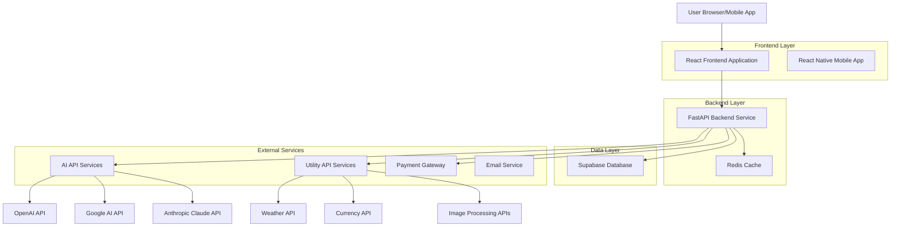
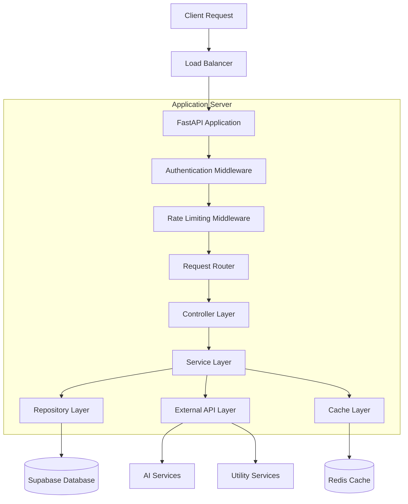
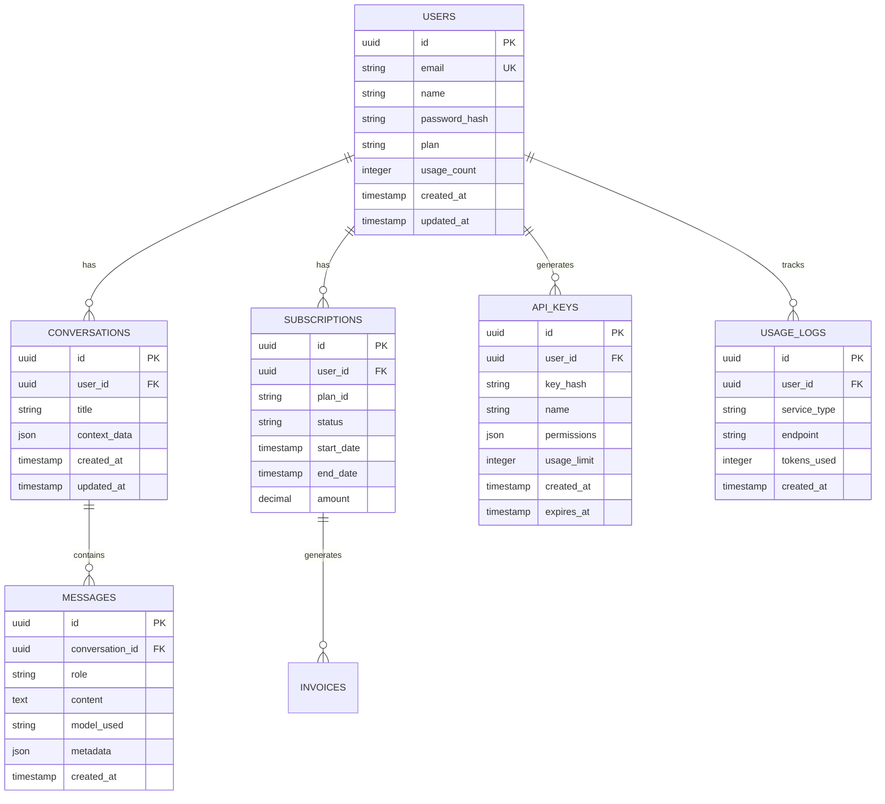

# AI Multi-Service Platform - Technical Architecture Document

## 1. Architecture Design



## 2. Technology Description

- **Frontend**: React@18 + Next.js@14 + Tailwind CSS@3 + TypeScript
- **Mobile**: React Native@0.72 + Expo@49
- **Backend**: FastAPI@0.104 + Python@3.11 + Pydantic@2
- **Database**: Supabase (PostgreSQL@15)
- **Cache**: Redis@7 (via Upstash free tier)
- **Authentication**: Supabase Auth + JWT
- **Payments**: Razorpay Integration
- **Deployment**: Vercel (Frontend) + Railway (Backend)
- **Monitoring**: Sentry (Error tracking) + Uptime Robot

## 3. Route Definitions

| Route | Purpose |
|-------|----------|
| / | Landing page with hero section and pricing |
| /chat | Main AI chat interface with context memory |
| /dashboard | User dashboard with analytics and settings |
| /utilities | Utility services (weather, currency, image tools) |
| /pricing | Detailed pricing plans and comparison |
| /auth/login | User authentication and registration |
| /auth/callback | OAuth callback handling |
| /profile | User profile management and preferences |
| /api-docs | API documentation for developers |
| /admin | Admin panel for system management |

## 4. API Definitions

### 4.1 Core API

**Authentication APIs**

```
POST /api/auth/register
```

Request:
| Param Name | Param Type | isRequired | Description |
|------------|------------|------------|-------------|
| email | string | true | User email address |
| password | string | true | User password (min 8 chars) |
| name | string | true | User full name |

Response:
| Param Name | Param Type | Description |
|------------|------------|-------------|
| success | boolean | Registration status |
| user | object | User profile data |
| token | string | JWT access token |

```
POST /api/auth/login
```

Request:
| Param Name | Param Type | isRequired | Description |
|------------|------------|------------|-------------|
| email | string | true | User email address |
| password | string | true | User password |

Response:
| Param Name | Param Type | Description |
|------------|------------|-------------|
| success | boolean | Login status |
| user | object | User profile data |
| token | string | JWT access token |
| refresh_token | string | Refresh token for session |

**AI Chat APIs**

```
POST /api/chat/message
```

Request:
| Param Name | Param Type | isRequired | Description |
|------------|------------|------------|-------------|
| message | string | true | User message content |
| model | string | false | Preferred AI model (gpt-4, claude, gemini) |
| context_id | string | false | Conversation context ID |

Response:
| Param Name | Param Type | Description |
|------------|------------|-------------|
| response | string | AI generated response |
| model_used | string | Actual model used for response |
| context_id | string | Updated context ID |
| usage | object | Token usage statistics |

```
GET /api/chat/history
```

Response:
| Param Name | Param Type | Description |
|------------|------------|-------------|
| conversations | array | List of conversation objects |
| total_count | integer | Total conversation count |
| page | integer | Current page number |

**Utility Service APIs**

```
GET /api/utilities/weather
```

Request:
| Param Name | Param Type | isRequired | Description |
|------------|------------|------------|-------------|
| location | string | true | City name or coordinates |
| units | string | false | Temperature units (celsius/fahrenheit) |

Response:
| Param Name | Param Type | Description |
|------------|------------|-------------|
| current | object | Current weather data |
| forecast | array | 5-day weather forecast |
| location | object | Location information |

```
POST /api/utilities/currency
```

Request:
| Param Name | Param Type | isRequired | Description |
|------------|------------|------------|-------------|
| from_currency | string | true | Source currency code (USD, EUR, INR) |
| to_currency | string | true | Target currency code |
| amount | number | true | Amount to convert |

Response:
| Param Name | Param Type | Description |
|------------|------------|-------------|
| converted_amount | number | Converted amount |
| exchange_rate | number | Current exchange rate |
| last_updated | string | Rate last updated timestamp |

**Subscription APIs**

```
POST /api/subscription/upgrade
```

Request:
| Param Name | Param Type | isRequired | Description |
|------------|------------|------------|-------------|
| plan_id | string | true | Subscription plan identifier |
| payment_method | string | true | Payment method token |

Response:
| Param Name | Param Type | Description |
|------------|------------|-------------|
| success | boolean | Upgrade status |
| subscription | object | Updated subscription details |
| invoice_url | string | Payment invoice URL |

## 5. Server Architecture Diagram



## 6. Data Model

### 6.1 Data Model Definition



### 6.2 Data Definition Language

**Users Table**
```sql
-- Create users table
CREATE TABLE users (
    id UUID PRIMARY KEY DEFAULT gen_random_uuid(),
    email VARCHAR(255) UNIQUE NOT NULL,
    name VARCHAR(100) NOT NULL,
    password_hash VARCHAR(255) NOT NULL,
    plan VARCHAR(20) DEFAULT 'free' CHECK (plan IN ('free', 'pro', 'enterprise')),
    usage_count INTEGER DEFAULT 0,
    created_at TIMESTAMP WITH TIME ZONE DEFAULT NOW(),
    updated_at TIMESTAMP WITH TIME ZONE DEFAULT NOW()
);

-- Enable RLS (Row Level Security)
ALTER TABLE users ENABLE ROW LEVEL SECURITY;

-- Create policies
CREATE POLICY "Users can view own profile" ON users
    FOR SELECT USING (auth.uid() = id);

CREATE POLICY "Users can update own profile" ON users
    FOR UPDATE USING (auth.uid() = id);

-- Grant permissions
GRANT SELECT ON users TO anon;
GRANT ALL PRIVILEGES ON users TO authenticated;
```

**Conversations Table**
```sql
-- Create conversations table
CREATE TABLE conversations (
    id UUID PRIMARY KEY DEFAULT gen_random_uuid(),
    user_id UUID NOT NULL,
    title VARCHAR(255) NOT NULL DEFAULT 'New Conversation',
    context_data JSONB DEFAULT '{}',
    created_at TIMESTAMP WITH TIME ZONE DEFAULT NOW(),
    updated_at TIMESTAMP WITH TIME ZONE DEFAULT NOW()
);

-- Create indexes
CREATE INDEX idx_conversations_user_id ON conversations(user_id);
CREATE INDEX idx_conversations_created_at ON conversations(created_at DESC);

-- Enable RLS
ALTER TABLE conversations ENABLE ROW LEVEL SECURITY;

-- Create policies
CREATE POLICY "Users can manage own conversations" ON conversations
    FOR ALL USING (auth.uid() = user_id);

-- Grant permissions
GRANT SELECT ON conversations TO anon;
GRANT ALL PRIVILEGES ON conversations TO authenticated;
```

**Messages Table**
```sql
-- Create messages table
CREATE TABLE messages (
    id UUID PRIMARY KEY DEFAULT gen_random_uuid(),
    conversation_id UUID NOT NULL,
    role VARCHAR(20) NOT NULL CHECK (role IN ('user', 'assistant', 'system')),
    content TEXT NOT NULL,
    model_used VARCHAR(50),
    metadata JSONB DEFAULT '{}',
    created_at TIMESTAMP WITH TIME ZONE DEFAULT NOW()
);

-- Create indexes
CREATE INDEX idx_messages_conversation_id ON messages(conversation_id);
CREATE INDEX idx_messages_created_at ON messages(created_at DESC);

-- Enable RLS
ALTER TABLE messages ENABLE ROW LEVEL SECURITY;

-- Create policies
CREATE POLICY "Users can view messages from own conversations" ON messages
    FOR SELECT USING (
        conversation_id IN (
            SELECT id FROM conversations WHERE user_id = auth.uid()
        )
    );

-- Grant permissions
GRANT SELECT ON messages TO anon;
GRANT ALL PRIVILEGES ON messages TO authenticated;
```

**Subscriptions Table**
```sql
-- Create subscriptions table
CREATE TABLE subscriptions (
    id UUID PRIMARY KEY DEFAULT gen_random_uuid(),
    user_id UUID NOT NULL,
    plan_id VARCHAR(50) NOT NULL,
    status VARCHAR(20) DEFAULT 'active' CHECK (status IN ('active', 'cancelled', 'expired')),
    start_date TIMESTAMP WITH TIME ZONE DEFAULT NOW(),
    end_date TIMESTAMP WITH TIME ZONE,
    amount DECIMAL(10,2) NOT NULL,
    created_at TIMESTAMP WITH TIME ZONE DEFAULT NOW()
);

-- Create indexes
CREATE INDEX idx_subscriptions_user_id ON subscriptions(user_id);
CREATE INDEX idx_subscriptions_status ON subscriptions(status);

-- Enable RLS
ALTER TABLE subscriptions ENABLE ROW LEVEL SECURITY;

-- Create policies
CREATE POLICY "Users can view own subscriptions" ON subscriptions
    FOR SELECT USING (auth.uid() = user_id);

-- Grant permissions
GRANT SELECT ON subscriptions TO anon;
GRANT ALL PRIVILEGES ON subscriptions TO authenticated;
```

**Usage Logs Table**
```sql
-- Create usage_logs table
CREATE TABLE usage_logs (
    id UUID PRIMARY KEY DEFAULT gen_random_uuid(),
    user_id UUID NOT NULL,
    service_type VARCHAR(50) NOT NULL,
    endpoint VARCHAR(100) NOT NULL,
    tokens_used INTEGER DEFAULT 0,
    created_at TIMESTAMP WITH TIME ZONE DEFAULT NOW()
);

-- Create indexes
CREATE INDEX idx_usage_logs_user_id ON usage_logs(user_id);
CREATE INDEX idx_usage_logs_created_at ON usage_logs(created_at DESC);
CREATE INDEX idx_usage_logs_service_type ON usage_logs(service_type);

-- Enable RLS
ALTER TABLE usage_logs ENABLE ROW LEVEL SECURITY;

-- Create policies
CREATE POLICY "Users can view own usage logs" ON usage_logs
    FOR SELECT USING (auth.uid() = user_id);

-- Grant permissions
GRANT SELECT ON usage_logs TO anon;
GRANT ALL PRIVILEGES ON usage_logs TO authenticated;
```

## 7. Deployment Strategy

### 7.1 Development Environment
- **Frontend**: Local development with Vite dev server
- **Backend**: Local FastAPI with hot reload
- **Database**: Supabase cloud instance (free tier)
- **Cache**: Local Redis or Upstash free tier

### 7.2 Production Environment
- **Frontend**: Vercel deployment with automatic CI/CD
- **Backend**: Railway deployment with auto-scaling
- **Database**: Supabase production instance
- **Cache**: Upstash Redis (paid tier when revenue allows)
- **CDN**: Cloudflare for static assets
- **Monitoring**: Sentry for error tracking, Uptime Robot for availability

### 7.3 CI/CD Pipeline
- **Source Control**: GitHub with branch protection
- **Testing**: Automated tests on pull requests
- **Deployment**: Automatic deployment on main branch merge
- **Rollback**: Quick rollback capability for production issues

## 8. Security Considerations

### 8.1 Authentication & Authorization
- JWT tokens with short expiration (15 minutes)
- Refresh token rotation for security
- Role-based access control (RBAC)
- API key authentication for external access

### 8.2 Data Protection
- Encryption at rest and in transit (TLS 1.3)
- Personal data anonymization options
- GDPR compliance with data export/deletion
- Regular security audits and penetration testing

### 8.3 API Security
- Rate limiting per user and IP
- Input validation and sanitization
- SQL injection prevention
- CORS configuration for frontend domains

## 9. Scalability Plan

### 9.1 Horizontal Scaling
- Stateless backend services for easy scaling
- Load balancing across multiple instances
- Database read replicas for query optimization
- CDN for static content distribution

### 9.2 Performance Optimization
- Redis caching for frequently accessed data
- Database query optimization and indexing
- Lazy loading for frontend components
- Image optimization and compression

### 9.3 Monitoring & Alerting
- Real-time performance monitoring
- Automated alerting for system issues
- User behavior analytics
- Resource usage tracking and optimization

This technical architecture provides a solid foundation for building a scalable, secure, and maintainable AI Multi-Service Platform while leveraging free and low-cost resources suitable for a student startup with zero budget constraints.